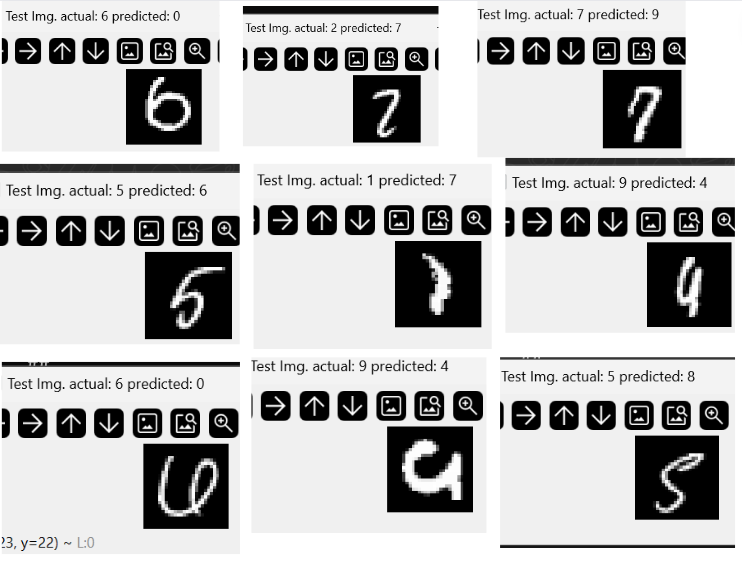

# MNIST_NUMC Project

This project implements a 2-layer neural network trained on the MNIST dataset using NumC for numerical computations. The project includes functionalities for defining neural network layers, implementing loss functions, using optimizers, and training the model.

## Contents

1. [NeuralNet Header](#neuralnet-header)
2. [Results](#results)
3. [Failed Cases](#failed-cases)

## NeuralNet Header

The `neuralNet.cuh` header file contains the definition of the `NeuralNet` class, which represents a 2-layer neural network going to be trained on MNIST.

### Class Members

- `affine_layers`: Vector of affine layers for the neural network.
- `relu_layers`: Vector of ReLU activation layers for introducing non-linearity.
- `dropout_layers`: Vector of dropout layers for regularization.
- `adam_configs`: Vector of Adam optimizer configurations for parameter updates.
- `reg`: Regularization strength.
- `p_keep`: dropout strength (probablity of keeping a node active)
- `mode`: Training mode (eval or train).

### Functions

- `NeuralNet`: Constructor for initializing the neural network.
- `train`: Switches the mode to training mode.
- `eval`: Switches the mode to evaluation mode.
- `forward`: Forward pass of the model, returns output array.
- `backward`: Backward pass of the neural network.
- `adamStep`: Updates parameters using the Adam optimizer.

For detailed documentation of the functions and class members, refer to the [NeuralNet Header](./include/neuralNet.cuh).

## Results

After training the neural network on the MNIST dataset, on parameters:
- `network_layers` = [784, 2048], [2048, 10]
- `batch_size` = 512
- `reg` = 0 
- `p_keep` = 0.731
- `lr` = 0.001
- `beta1` = 0.9
- `beta2` = 0.99

Dataset stats:
- `tot_train_imgs`: 60000
- `tot_test_imgs`: 10000

After splitting validation set randomly,
- `train_set_size`: 58000
- `val_set_size`: 2000
- `test_set_size`: 10000

the following results were obtained:

- <b>Training Accuracy</b>: 100 %
- <b>Validation Accuracy</b>: 100 %
- <b>Test Accuracy</b>: 96.0 %

## Failed Cases

During testing, the following cases failed to produce accurate predictions:

These cases demonstrate the challenges in accurately classifying certain digits, especially when they exhibit similarities or complexities that can confuse the model. The misclassification in these cases is understandable given the inherent difficulty in distinguishing certain handwritten digits.

## Usage
* To build and run this project, CMakeLists.txt has been provided.
* To use the neural network implementation in your projects, include the `neuralNet.cuh` header file and utilize the provided functions for training, evaluation, and prediction.

## Acknowledgements
* This project draws inspiration from deep learning frameworks and concepts taught in various courses, including CS231n (Convolutional Neural Networks for Visual Recognition) by Stanford University.
* The MNIST dataset used in this project is made available by Yann LeCun, Corinna Cortes, and Christopher J.C. Burges. 
* Book - Programming Massively Parallel Processors by Wen-mei W. Hwu, David B. Kirk, Izzar El Hajj.
* Online resources such as Stack Overflow, GitHub Discussions, and forums like Reddit's r/MachineLearning and r/cpp_questions for helpful discussions, solutions to challenges, and shared knowledge.
---

**Note**: The above information is a general overview of the "MNIST_NUMC" project. For detailed documentation of submodules, refer to the respective README files within each section.
